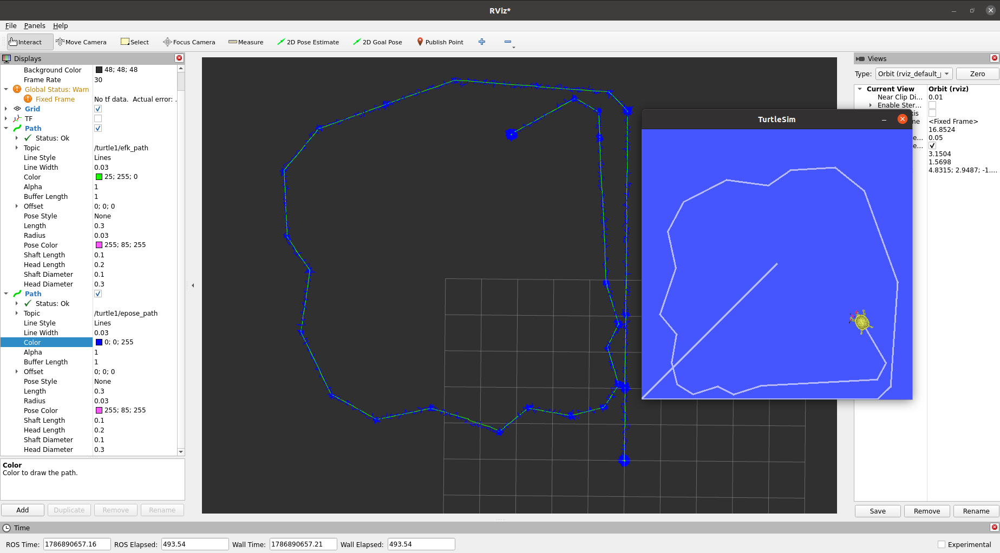

# Robotics Sensor Fusion Sandbox
A modular C++ / ROS 2 repository for robot state estimation algorithms, featuring Lie-Algebra Extended Kalman Filters (EKF) and Graph Optimization (g2o)[todo].



## 📌 Features
- **3D Lie-Algebra EKF (`turtlesim_ekf`)**: SO(3)/SE(3) manifold state estimation filtering linear and angular velocity noise.
- **Simulation Environment (`turtlesim_robot`)**: Mimic noise generator injecting white noise into velocities and absolute poses.

<!-- - **Factor Graph Optimization (`turtlesim_g2o`)** *(In Progress)*: Non-linear pose-graph optimization using `g2o`. -->

## TODO 
- Adding G2o Node 

## 🛠️ Build & Run


<!-- git clone [https://github.com/your-username/sensor-fusion-sandbox.git](https://github.com/your-username/sensor-fusion-sandbox.git) . -->

```bash
# Clone the repository into your workspace
cd ~/ros2_ws/src

# Install dependencies and build
cd ~/ros2_ws
rosdep install --from-paths src --ignore-src -r -y
colcon build --symlink-install

# Run EKF Node
source install/setup.bash

## Run turtlesim node 
ros2 run turtlesim turtlesim_node
ros2 run turtlesim turtle_teleop_key

## Run adding noise node 
ros2 run turtlesim_robot  turtlesim_robot_positioning
ros2 run turtlesim_robot turtlesim_robot_odometry

## Run EKF node  
ros2 run turtlesim_ekf run_ekf_node
```

# Acknowledgments

The core concept for using `turtlesim` as a lightweight testing environment—specifically injecting noise into wheel twist velocities and absolute pose measurements to evaluate sensor fusion performance—was inspired by [Kapernikov's tutorial on the ROS `robot_localization` package](https://kapernikov.com/the-ros-robot_localization-package/).